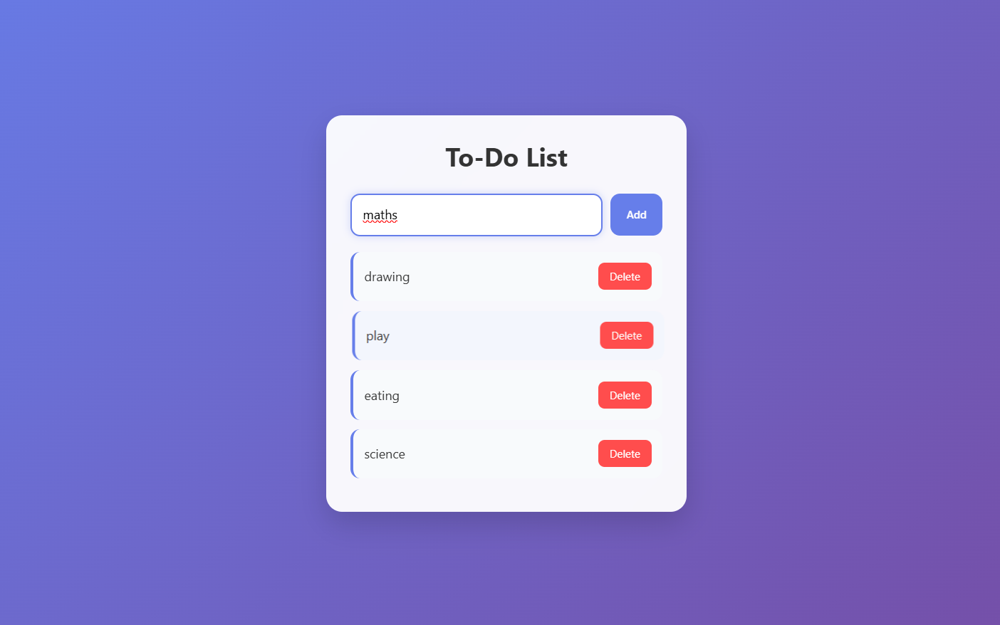

# SCT_WD_4
# 📝 To-Do List Web Application

A simple, responsive, and user-friendly To-Do List application built using **HTML**, **CSS**, and **JavaScript**. This project helps users manage daily tasks efficiently through an intuitive interface and interactive features.

## 🚀 Features

* Add new tasks
* Add tasks by pressing the **Enter** key
* Mark tasks as completed
* Delete tasks with a confirmation prompt
* Responsive design for different screen sizes
* Modern and clean user interface
* Smooth hover and transition effects

## 🛠️ Technologies Used

* **HTML5** – Structure and layout
* **CSS3** – Styling and responsiveness
* **JavaScript (ES6)** – Functionality and interactivity

## 📂 Project Structure

```
todo-list/
│
├── index.html
├── style.css
├── script.js
└── README.md
```

## 📖 How to Run

1. Clone the repository:

```bash
git clone https://github.com/your-username/todo-list.git
```

2. Navigate to the project folder:

```bash
cd todo-list
```

3. Open `index.html` in your preferred web browser.

No additional dependencies or installations are required.

## 💡 Usage

1. Enter a task in the input field.
2. Click the **Add** button or press **Enter** to add the task.
3. Click on a task to mark it as completed.
4. Click the **Delete** button to remove a task.
5. Confirm the deletion when prompted.

## 🔮 Future Enhancements

* Local Storage support for persistent tasks
* Task categories and priorities
* Due dates and reminders
* Dark mode
* Drag-and-drop task reordering
* Custom modal dialogs

## 🎯 Learning Outcomes

This project demonstrates:

* DOM Manipulation
* Event Handling
* Responsive Web Design
* JavaScript Functions and Event Listeners
* User Interface Design Principles

## 📄 License

This project is open source and available under the MIT License.

---

Developed as a front-end web development project using HTML, CSS, and JavaScript.
